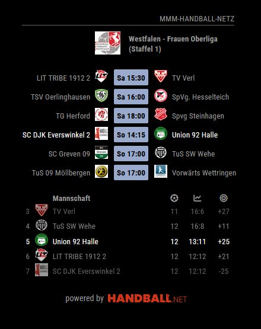
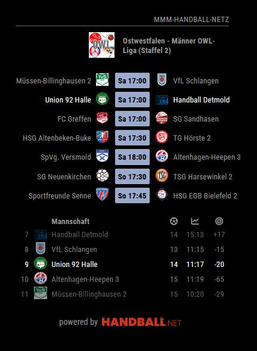

# MMM-handball-netz [](https://raw.githubusercontent.com/fewieden/MMM-handball-netz/master/LICENSE)

A Handball Standings Module for MagicMirror², based on @fewiedens [MMM-soccer](https://github.com/fewieden/MMM-handball-netz)

## Examples

 

## Dependencies

* An installation of [MagicMirror²](https://github.com/MichMich/MagicMirror)
* OPTIONAL: [Voice Control](https://github.com/fewieden/MMM-voice)
* npm
* [axios](https://www.npmjs.com/package/axios)

## Installation

1. Clone this repo into your `~/MagicMirror/modules` directory.
```
git clone https://github.com/tschumel/MMM-handball-netz
```
2. Run command `npm install` in `~/MagicMirror/modules/MMM-handball-netz` directory.

3. Add the module to your `~/MagicMirror/config/config.js`
You can copy & paste the example configuration below into your config.js File. It's a good starting point to cusomize your MMM-handball-netz instance.

## Update

1. In your terminal, go to your MMM-handball-netz's Module folder:
```
cd ~/MagicMirror/modules/MMM-handball-netz
```
2. Incorporate changes from this repository:

```
git pull
```

3. Install dependencies:

```
npm install
```


## Example config
```
{
    module: 'MMM-handball-netz',
    position: 'top_left',
    config: {
        show: [
			'nuliga.hnr.151945#nuliga.hnr.390589', // A-Jugend männlich (Essen) 
			'handball4all.westfalen.owl-l-mst2_wfow',
			'handball4all.westfalen.hvw-fol1_hvwf',
			'handball4all.westfalen.owl-l-fst2_wfow',
			'sportradar.hbf.228', // 1HBL 
			'sr.competition.149', // HBL 
			'sportradar.hbf.312', // 2HBL Frauen
			'sr.competition.921', // 2HBL
			],
        colored: true,
        updateInterval: 30,// Anzeigedauer pro Liga
        max_teams: 5,
        matchType: 'league', // 'next', 'league',
		showMatches: true,
		logos: true,
		focus_on: {
			'nuliga.hnr.151945#nuliga.hnr.390589' : 'LTV Wuppertal',
			'handball4all.westfalen.owl-l-mst2_wfow': 'Union 92 Halle',
			'handball4all.westfalen.hvw-fol1_hvwf': 'Union 92 Halle',
			'handball4all.westfalen.owl-l-fst2_wfow': 'Union 92 Halle',
			'sr.competition.149' : 'THW Kiel',
			'sr.competition.921' : 'TuSEM Essen',
			'sportradar.hbf.228' : 'Buxtehuder SV',
			'sportradar.hbf.312' : 'SV Union Halle-Neustadt',
			'handball4all.westfalen.hvw-mb-ol1_hvwf' : 'Union 92 Halle',
		},		
		liveMode: false	
    }
},
```

## Determine the league-ID and league-phase of the league-schedule

First find the league-ID of your favorit League in handball.net. Double check that you have actually accessed the league schedule and not the schedule of your favorite team!
The URL should be structured as follows:
```
`https://<DOMAIN>/widgets/ligen/<LEAGUE-ID>/spielplan`
```
Example URL:
```
`https://www.handball.net/widgets/ligen/handball4all.westfalen.owl-l-mst2_wfow/spielplan`
```
add the ID in the section of the MMM-handball-netz config.js section as below:
```
`'<LEAGUE-ID>'`
```
Example:
```
`'handball4all.westfalen.owl-l-mst2_wfow'`
```

If the league is divided into different groups, sequences or phases, you must also select the desired phase:
```
`https://<DOMAIN>/widgets/ligen/<LEAGUE-ID>/spielplan?phase=<PHASE-ID>`
```

Example URL:
```
`https://www.handball.net/ligen/nuliga.bhv.157572/spielplan?phase=nuliga.bhv.379017`
```

the resulting ID you have to specify in the config.js is the LEAGUE-ID followed by a hash-symbol (#) and the PHASE-ID
```
`'<LEAGUE-ID>#<PHASE-ID>'`
```
Example:
```
`'nuliga.bhv.157572#nuliga.bhv.379017'`
```

## Config Options

| **Option** | **Default** | **Description** |
| --- | --- | --- |
| `width` | `400` | Width of match and standings table. The module has a flexible design aligning matches and table vertically or horizontically as space allows. |
| `colored` | true | Boolean to show club logos in color or not. |
| `show` | ['sportradar.hbf.228', 'sr.competition.149', 'sportradar.hbf.312', 'sr.competition.921'] | An array of league codes to be displayed. In normal mode, the leagues revolve using below update cycle. With activated touch mode (see below), you can choose one of the leagues via a button (planned) |
| `updateInterval` | 60 | The time frame for each league to be shown in seconds. |
| `apiCallInterval` | 10 | The time frame for API calls (in minutes) in normal mode. |
| `showMatches` | true | Show matches of current league |
| `showTables` | true | Show table of current league. **Note:** For cups like Champions League, this will be set to false in knockout rounds. |
| `focus_on` | null | Which team to focus on per league. This needs to be an object, e.g. {'BL1': 'FC Bayern München', 'CL': 'Liverpool FC'}. **See description below.** |
| `fadeFocus` | true | Includes fading the teams out if one is focused. |
| `max_teams` | false | How many teams should be displayed when focus is activated. Omit this option or set to false to show the full league table. |
| `replace` | 'default' | Choose between 'default' for a default replacement of original club names or 'short' for a 3-Letter-Code of the teams. Choose anything else (like '') for original team names from the API. **See below** for further information |
| `logos` | true | Boolean to show club logos. |
| `liveMode` | true | Activates live mode when games are in play. (planned) (see below) |
| `matchType` | 'league' | In the moment only Leagues are provided: `'league'` for showing the current matchday of selected leagues (in `show`) |
| `numberOfNextMatches` | 8 | Defines number of next matches of all focused clubs for matchType `'next'` |
| `touchMode` | false | Activates touch mode with touch options (see below, not active yet) |
| `debug` | false | Debug mode: additional output on server side (console) and client side (browser) |


## Focus

You can focus on one time per league using the focus_on method. This variable needs to be an object.
An example is below:
```
focus_on: {
	'sr.competition.149' : 'THW Kiel',
},
```
Please take care to include all quotation marks, separate with commata, and use the same league codes (find below) you have included in the 'show' array.
The team name needs to correspond to the original name of the team as provided by the API.
Have a look into the `replace` object in the config to see if the team name is replaced with a shorter one on the mirror. If that is the case, take the original one (the one on the left for each replace property).

Omitting a league code from `'show'` in this array will show the full league table and not include any focus.
Any league included here need to be included in `'show'` as well to show the league on your mirror.

## Replacements
There is a `replacements.json` file in the directory including all teams of the free plan. By default, the default replacement for the original team name will be used in the module. You can choose between 'default' mode or 'short' mode showing the 3-letter ID code for the team for a super slim module.
There is no need to add Teams with different Team-Numbers in the replacments.json File
Example Entry:	"JSG Handball Löhne-Mennighüffen-Obernbeck":"JSG Handball LöhMeOb",
Will also replace SG Handball Löhne-Mennighüffen-Obernbeck 3 => JSG Handball LöhMeOb 3 and so on.

Also roman Numbers will be detected as Team-Numbers: "TuS 97 Bielefeld/Jöllenbeck":"TuS Bielefeld-Jöllenbeck",
Will also replace TuS 97 Bielefeld/Jöllenbeck II => TuS Bielefeld-Jöllenbeck II and so on.

## Live Mode (planned)

The module calls all requested matches every X minutes (see config option `apiCallInterval`). Whenever one or more matches are scheduled in less than this interval, a Live Mode will activate.
All matches currently played will be included in an array and requested once every minute.
~Additional informations like game minute and scorers will be provided for these games.~ (another API is needed for this)
Also, only the leagues with current matches will be shown.
When no game is live, the module will return back to normal mode.

Can be switched off in config.


## Touch mode (planned)

Touch mode will create buttons to choose between leagues.
It is also planned to include more detailed information like scorers per league and scorers per game.

Can be switched off in config.


## OPTIONAL: Voice Control (may be bugged!)


### Mode


### List of all Voice Commands


### TODOs

- [ ] Touch mode
- [x] Highlight currently playing teams in table.

